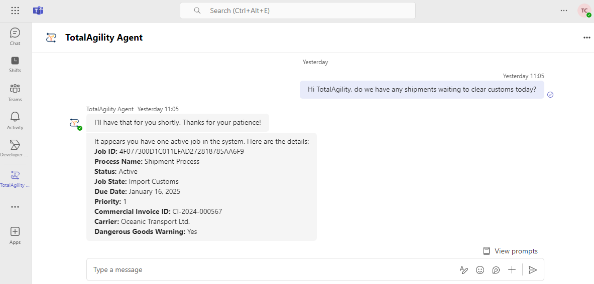

# Teams Chat Client for TotalAgility Agents

This repository is a lightweight Microsoft Teams **Chat Client** (using the Microsoft Bot Framework) that proxies chat interactions to TotalAgility **Chat Agents** (or custom LLM-backed Agents) via REST APIs. It displays Chat Agent responses in Teams while leaving the automation, data access, and LLM logic inside TotalAgility.



Key capabilities:
- Proxy Teams chat to a TotalAgility Chat Agent (or Custom LLM) using REST/OpenAPI
- Preserve and pass conversation history to the Chat Agent to maintain context
- Support for sending documents (file upload) to the Chat Agent (see Version notes)
- Minimal Chat Client logic so the Chat Agent process in TotalAgility can own orchestration, knowledge access and calling other sub-agents

Why use this sample
- It demonstrates how Teams can be used as a Chat Client for complex automation and LLM-driven processes implemented in TotalAgility (workflows, case management, RPA, IDP, knowledge base lookups, document generation, eSigning, etc.).

Architecture summary
- The Teams Chat Client acts as a thin proxy: it accepts user messages, forwards them (with conversation history) to a TotalAgility Chat Agent endpoint, then renders the Chat Agent's response in Teams.
- The recommended pattern is an "Intent Router" Chat Agent in TotalAgility that receives the prompt, evaluates intent via an LLM step, and routes to specific sub-agents/processes (each with the same Chat Agent interface).

Supported channels
- Microsoft Teams (primary)
- Any Bot Framework channel (Webchat, Facebook Messenger, WhatsApp, Alexa, etc.) with minimal changes.

Project structure and where to make edits
- appPackage/: Teams app manifest and package. Example prompts and app configuration live in `appPackage/manifest.json`.
- src/: core application code
	- `src/index.js` — app entry point and server bootstrap
	- `src/config.js` — configuration loader and environment handling
	- `src/taAgent.js` — main TotalAgility API integration and the primary place to change how the app calls your Agent (seed usage, request shape, headers, error handling)
	- `src/teamsBot.js` — Teams/Microsoft Bot framework adapter and conversation turn handling
	- `src/conversationStore.js` — Azure Table Storage–backed persistence for conversation references (proactive messaging)
	- `src/utils.js` — helper functions including loading/typing feedback messages (customize UI text here)
- env/: environment template files — update these to match your tenant, keys and Agent details
- infra/: infrastructure deployment scripts (Azure Bicep templates used for provisioning, if desired)
- devTools/: developer utilities (Teams App Tester, etc.)

Important files to edit for common tasks
- Change the Agent integration or modify request details: `src/taAgent.js`
- Adjust loading/typing UI and helper utilities: `src/utils.js`
- For Teams-specific behaviour or message formatting, update `src/teamsBot.js` and `src/index.js`.
- Keep environment-specific secrets out of source control. Use the `env/` templates and local environment variables when running locally.

Environment variables / configuration
Place your environment values in the files under `env/` (or in your system environment). The sample adds the following keys:

```
TOTALAGILITY_ENDPOINT=
TOTALAGILITY_API_KEY=
TOTALAGILITY_AGENT_NAME=
TOTALAGILITY_AGENT_ID=
TOTALAGILITY_TEST_USERNAME=
TOTALAGILITY_USE_TEST_USER=
CONVERSATION_HISTORY_MAX_ENTRIES=
NOTIFICATIONS_BEARER_TOKEN=
AZURE_STORAGE_CONNECTION_STRING=
PRELOAD_DOCUMENTS_AS_TOTALAGILITY_DOCS=
TOTALAGILITY_DOCUMENT_CREATOR_PROCESS_ID=
TOTALAGILITY_DOCUMENT_CREATOR_PROCESS_NAME=
TOTALAGILITY_DOCUMENT_TYPE_ID=
TOTALAGILITY_DOCUMENT_FILENAME_FIELD_ID=
```

> **Security note — `SECRET_` prefix convention:**
> Teams Toolkit automatically masks variables whose names start with `SECRET_` in
> build and deploy logs.  Sensitive values (API keys, tokens, connection strings)
> should use `SECRET_` prefixed variable names in `env/.env.*.user` files
> (e.g. `SECRET_TOTALAGILITY_API_KEY`, `SECRET_NOTIFICATIONS_BEARER_TOKEN`,
> `SECRET_AZURE_STORAGE_CONNECTION_STRING`).  The YAML files map these to the
> non-prefixed names the application code expects.

Notes on these values
- `TOTALAGILITY_ENDPOINT` — base TotalAgility REST/OpenAPI endpoint, e.g. `https://{{your_tenant}}.dev.kofaxcloud.com/services/sdk/v1`
- `TOTALAGILITY_API_KEY` — API key used to authenticate calls to TotalAgility
- `TOTALAGILITY_AGENT_NAME` — the process name of the Chat Agent in TotalAgility
- `TOTALAGILITY_AGENT_ID` — the process ID of the Chat Agent (often visible in the TotalAgility Designer edit URL)
- `TOTALAGILITY_TEST_USERNAME` & `TOTALAGILITY_USE_TEST_USER` — override SSO behaviour to force a test TA user (useful for development)
- `CONVERSATION_HISTORY_MAX_ENTRIES` — maximum number of messages to retain in the conversation history array sent to the Chat Agent. Defaults to `10` if not set or invalid. Higher values provide more context but increase payload size.

- `NOTIFICATIONS_BEARER_TOKEN` — a secret token that 3rd-party callers must present as a `Bearer` token when calling the notification endpoints. **Required** to enable `/api/notifications` and `/api/conversations`.
- `AZURE_STORAGE_CONNECTION_STRING` — connection string for an Azure Storage account used to persist conversation references in Azure Table Storage. When absent the app falls back to an in-memory store (references are lost on restart). For local development with Azurite use `UseDevelopmentStorage=true`.
- `PRELOAD_DOCUMENTS_AS_TOTALAGILITY_DOCS` — when `true`, uploaded files are first submitted to a dedicated "Document Creator" process in TotalAgility that stores the file and returns a Document ID.  That lightweight ID is then passed to the Chat Agent instead of the raw base64 content. Default: `false`. See [Document Preloading](#document-preloading-recommended-for-production) below.
- `TOTALAGILITY_DOCUMENT_CREATOR_PROCESS_ID` — the Process ID (GUID) of the TotalAgility Document Creator process. Required when `PRELOAD_DOCUMENTS_AS_TOTALAGILITY_DOCS=true`.
- `TOTALAGILITY_DOCUMENT_CREATOR_PROCESS_NAME` — the process name of the TotalAgility Document Creator process. Required when `PRELOAD_DOCUMENTS_AS_TOTALAGILITY_DOCS=true`.
- `TOTALAGILITY_DOCUMENT_TYPE_ID` — the Document Type ID (GUID) used when creating documents via the Document Creator process. Required when `PRELOAD_DOCUMENTS_AS_TOTALAGILITY_DOCS=true`. Default: `298D0A0CFE2342A4BB66E240E9E2967D` (the standard TotalAgility "Default Document Type" — this value is preset in all env templates and will work for most deployments).
- `TOTALAGILITY_DOCUMENT_FILENAME_FIELD_ID` — the RuntimeField ID (GUID) for the filename field on the document type. Required when `PRELOAD_DOCUMENTS_AS_TOTALAGILITY_DOCS=true`. Default: `1F8220766FAF42278F5CF8081DBF6D87` (preset in all env templates).

Behaviour notes
- The main API call is managed in `src/taAgent.js`. The Chat Client uses a hard-coded "seed" for consistent responses; remove or change this if you want nondeterministic LLM outputs.
- Loading messages can be configured in `src/utils.js`.
- Example prompts are available in `appPackage/manifest.json`.

How the Intent Router pattern works
- A controlling "Intent Router" Chat Agent evaluates incoming prompts using an LLM step and maps them to available actions / sub-agents. The router provides a registry of available Chat Agents (with ProcessIDs) and returns JSON mapped to the TotalAgility data model describing which sub-process to invoke and which prompt to send.
- Because all Chat Agents expose a common interface, the registry can include many agents; the router chooses the best match and may iterate multiple steps (search KB, call external APIs, gather documents) before returning a final response.

Example resources
- Tutorial video: Creating a Basic AI Agent in TotalAgility — https://www.tungstendemocenter.com/items/creating-a-basic-ai-agent-in-totalagility

Version notes 
### Version 1.1
- Added the ability to upload files and send these to the Chat Agent for processing. This sample uses TotalAgility 25.2 where the Chat Agent interface accepts TotalAgility Documents (sent as base64 strings) to the Jobs sync API.

### Version 1.2
- Added settings to SSO a user into TotalAgility based on their email address from their Teams login.

*Note:* the code assumes the user's email address (from their MS Teams login) is their user ID in TotalAgility. To override this, specify a test user in the environment and set the `TOTALAGILITY_USE_TEST_USER` flag to `true`.

Environment variables for SSO testing:

```
TOTALAGILITY_TEST_USERNAME=my_ta_test_account@test.com
TOTALAGILITY_USE_TEST_USER=true
```

### Version 1.3
- Added **proactive notification endpoint** (`POST /api/notifications`) that allows 3rd-party systems (e.g. TotalAgility workflows, Power Automate, external APIs) to push messages into a specific user's Teams session.
- Added **conversation listing endpoint** (`GET /api/conversations`) to discover which users have active conversation references.
- Conversation references are persisted to **Azure Table Storage** for durability across restarts (falls back to in-memory when `AZURE_STORAGE_CONNECTION_STRING` is not set).
- Both endpoints are protected by bearer-token authentication via `NOTIFICATIONS_BEARER_TOKEN`.

### Version 1.4
- **Security hardening:** added `helmet` for HTTP security headers, `express-rate-limit` on notification endpoints, startup config validation, request body size limits.
- **Secret management:** sensitive env vars now use the `SECRET_` prefix convention so Teams Toolkit masks them in logs.
- Fixed `.gitignore` to prevent `.localConfigs` (which contains runtime secrets) from being committed.

### Version 1.5
- Added **document preloading** (`PRELOAD_DOCUMENTS_AS_TOTALAGILITY_DOCS`) — an optional mode where uploaded files are first submitted to a dedicated TotalAgility "Document Creator" process to obtain a Document ID.  The Chat Agent then receives the lightweight ID via the `DOCUMENT` input variable instead of the full base64 string, significantly reducing database load for large files.
- Added new environment variables: `PRELOAD_DOCUMENTS_AS_TOTALAGILITY_DOCS`, `TOTALAGILITY_DOCUMENT_CREATOR_PROCESS_ID`, `TOTALAGILITY_DOCUMENT_CREATOR_PROCESS_NAME`, `TOTALAGILITY_DOCUMENT_TYPE_ID`, `TOTALAGILITY_DOCUMENT_FILENAME_FIELD_ID`.

#### Document Preloading (recommended for production)

When users upload files to the Chat Client, the default behaviour is to convert the file to a base64 string and pass it directly as an input variable (`DOCUMENT_CONTENT`) to the TotalAgility Chat Agent process (with `DOCUMENT` left empty).  While simple, this has a significant drawback: the entire base64 string is stored as a process variable in the TotalAgility database, which can be very large for multi-megabyte files.

**Document preloading** solves this by splitting the upload into two steps:

1. **Create the document** — the Chat Client calls a dedicated "Document Creator" process in TotalAgility (configured via `TOTALAGILITY_DOCUMENT_CREATOR_PROCESS_ID` / `TOTALAGILITY_DOCUMENT_CREATOR_PROCESS_NAME`).  The file is submitted as a document attachment in the `Documents` array (with `Base64Data`, `MimeType`, `DocumentTypeId`, and a `RuntimeFields` entry for the filename).  The response returns a top-level `DocumentId`.
2. **Call the Chat Agent** — the Chat Client calls the main Chat Agent process, passing the lightweight document reference via the `DOCUMENT` input variable (with `DOCUMENT_CONTENT`, `DOCUMENT_TYPE`, and `DOCUMENT_FILENAME` all empty) instead of the raw base64 string.  The Chat Agent can then retrieve the document from TotalAgility's document storage as needed.

**Benefits:**
- The document is stored once in TotalAgility's optimised document storage (not as a process variable).
- The Chat Agent process payload is much smaller, reducing database I/O and memory usage.
- Better suited for production deployments with large files or high throughput.

**How to enable:**
```
PRELOAD_DOCUMENTS_AS_TOTALAGILITY_DOCS=true
TOTALAGILITY_DOCUMENT_CREATOR_PROCESS_ID=<your-document-creator-process-id>
TOTALAGILITY_DOCUMENT_CREATOR_PROCESS_NAME=<your-document-creator-process-name>
TOTALAGILITY_DOCUMENT_TYPE_ID=298D0A0CFE2342A4BB66E240E9E2967D
TOTALAGILITY_DOCUMENT_FILENAME_FIELD_ID=1F8220766FAF42278F5CF8081DBF6D87
```

**Document Creator process requirements:**
The TotalAgility Document Creator process must:
1. Accept a document attachment in its `Documents` array.  The Chat Client submits the file with `Base64Data`, `MimeType`, `DocumentTypeId` (from `TOTALAGILITY_DOCUMENT_TYPE_ID`), and a `RuntimeFields` entry whose `Id` is `TOTALAGILITY_DOCUMENT_FILENAME_FIELD_ID` carrying the original filename.
2. Have `StoreFolderAndDocuments` enabled so the document is persisted in TotalAgility's document storage.
3. Return a top-level `DocumentId` in the `/jobs/sync` response (this is the standard TotalAgility behaviour when `StoreFolderAndDocuments=true` and `ReturnOnlySpecifiedDocuments=true`).

**Fallback:** If document preloading fails (e.g. the Document Creator process is unavailable), the Chat Client automatically falls back to sending the raw base64 string inline — so the user's request is not lost.

### Running and developing locally
- Install dependencies:

```bash
npm install
```

- Run the app locally (Teams development): use the Visual Studio Code tasks in this workspace or run the equivalent npm scripts. Example tasks present in the workspace:
	- `Start Teams App (Test Tool)` — starts the app using the Test Tool configuration
	- `Start Teams App Locally` — runs local tunnel, provision, deploy and starts the app

- Common npm scripts (available in `package.json`):

```bash
npm run dev:teamsfx        # start locally for Teams development
npm run dev:teamsfx:testtool  # start using the Test Tool flow
```

### Editing tips
- To change how the app calls TotalAgility (payload, headers, error handling), update `src/taAgent.js`.
- To change user-visible loading/typing messages, update `src/utils.js`.
- For Teams-specific behaviour or message formatting, update `src/teamsBot.js` and `src/index.js`.
- Keep environment-specific secrets out of source control. Use the `env/` templates and local environment variables when running locally.

### Proactive Notifications API

The Chat Client exposes two HTTP endpoints that allow external / 3rd-party applications to send messages directly into a user's Teams chat. This follows the [official Microsoft proactive messaging pattern](https://learn.microsoft.com/en-us/microsoftteams/platform/bots/how-to/conversations/send-proactive-messages).

**Prerequisites:**
1. Set the `NOTIFICATIONS_BEARER_TOKEN` environment variable to a strong secret.
2. Set the `AZURE_STORAGE_CONNECTION_STRING` environment variable for persistent storage (optional but recommended for production).
3. The target user must have interacted with the Chat Client at least once (or had it installed) so that their conversation reference is stored.

#### Finding your endpoint URL

The notification endpoint URL depends on where the Chat Client is running:

| Environment | Base URL | How to find it |
|-------------|----------|----------------|
| **Local development** | `http://localhost:3978` | Default port configured in `src/index.js`. The Chat Client listens on port `3978` unless overridden by the `PORT` environment variable. |
| **Azure (deployed)** | `https://<BOT_DOMAIN>` | After running `teamsapp provision` and `teamsapp deploy`, the `BOT_DOMAIN` value is written to `env/.env.dev`. Open that file and look for a line like `BOT_DOMAIN=botb556a8.azurewebsites.net`. Your full URL is `https://` + that value. |

**Full endpoint URLs:**

| Endpoint | Local URL | Azure URL |
|----------|-----------|-----------|
| Send notification | `POST http://localhost:3978/api/notifications` | `POST https://<BOT_DOMAIN>/api/notifications` |
| List conversations | `GET http://localhost:3978/api/conversations` | `GET https://<BOT_DOMAIN>/api/conversations` |

**Where to find each configuration value:**

| Value | Where to find it |
|-------|-----------------|
| **Bot hostname** (`BOT_DOMAIN`) | `env/.env.dev` — populated after `teamsapp provision`. Example: `botb556a8.azurewebsites.net` |
| **Bearer token** | `SECRET_NOTIFICATIONS_BEARER_TOKEN` in your `env/.env.dev.user` (or `env/.env.local`, `env/.env.testtool` for local dev) |
| **User key** | The email address of any user who has messaged the Chat Client. Verify available users via `GET /api/conversations`. |

**Public access:** Azure App Service is publicly accessible by default over HTTPS (port 443). No additional networking configuration is needed — if the Bot Framework Channel Service can reach the Chat Client at `https://<BOT_DOMAIN>/api/messages`, then 3rd-party apps can reach `/api/notifications` at the same hostname.

> **Tip — restricting access:** If you want to limit which systems can call the notification endpoint (beyond bearer-token auth), configure **Azure App Service → Networking → Access Restrictions** in the Azure Portal to whitelist specific IP ranges.

#### `POST /api/notifications`

Send a proactive message to a specific user.

**Headers:**
```
Authorization: Bearer <NOTIFICATIONS_BEARER_TOKEN>
Content-Type: application/json
```

**Request body:**
```json
{
  "userKey": "jane.doe@contoso.com",
  "message": "Your document has been processed successfully."
}
```

| Field | Type | Description |
|-------|------|-------------|
| `userKey` | string | The user's email address (or Teams display name) as registered when they last interacted with the Chat Client. Case-insensitive. |
| `message` | string | The message text to send to the user in their Teams chat. Supports Markdown. Max 4000 characters. |

**Responses:**

| Status | Meaning |
|--------|---------|
| `200`  | Message sent successfully. |
| `400`  | Missing `userKey` or `message` in request body. |
| `401`  | Invalid or missing bearer token. |
| `404`  | No conversation reference found for the given `userKey`. |
| `429`  | Rate limit exceeded — try again later. |
| `500`  | Internal server error. |
| `503`  | `NOTIFICATIONS_BEARER_TOKEN` is not configured. |

**Example (cURL):**
```bash
curl -X POST https://your-bot-host/api/notifications \
  -H "Authorization: Bearer YOUR_SECRET_TOKEN" \
  -H "Content-Type: application/json" \
  -d '{"userKey": "jane.doe@contoso.com", "message": "Job 12345 is complete."}'
```

**Example (JavaScript / Node.js):**
```javascript
const response = await fetch("https://your-bot-host/api/notifications", {
  method: "POST",
  headers: {
    "Authorization": "Bearer YOUR_SECRET_TOKEN",
    "Content-Type": "application/json",
  },
  body: JSON.stringify({
    userKey: "jane.doe@contoso.com",
    message: "**Document processed** ✅\nYour invoice #12345 has been approved.",
  }),
});

const result = await response.json();
console.log(result); // { status: "ok", userKey: "jane.doe@contoso.com", message: "..." }
```

**Example (PowerShell):**
```powershell
$headers = @{
    "Authorization" = "Bearer YOUR_SECRET_TOKEN"
    "Content-Type"  = "application/json"
}
$body = @{
    userKey = "jane.doe@contoso.com"
    message = "Your TotalAgility job has completed successfully."
} | ConvertTo-Json

Invoke-RestMethod -Uri "https://your-bot-host/api/notifications" `
    -Method POST -Headers $headers -Body $body
```

**Example (Python):**
```python
import requests

response = requests.post(
    "https://your-bot-host/api/notifications",
    headers={
        "Authorization": "Bearer YOUR_SECRET_TOKEN",
        "Content-Type": "application/json",
    },
    json={
        "userKey": "jane.doe@contoso.com",
        "message": "Your document has been classified and is ready for review.",
    },
)
print(response.json())
```

**Example — calling from a TotalAgility process:**

In a TotalAgility process, use a **REST Service** activity to call the notification endpoint. Configure:
- **URL:** `https://your-bot-host/api/notifications`
- **Method:** `POST`
- **Headers:** `Authorization: Bearer YOUR_SECRET_TOKEN` and `Content-Type: application/json`
- **Body:** Map process variables to produce `{"userKey": "<email>", "message": "<notification text>"}`

This allows any TotalAgility workflow to push status updates directly into a user's Teams chat.

#### `GET /api/conversations`

List all users with stored conversation references (useful for diagnostics and discovering valid `userKey` values).

**Headers:**
```
Authorization: Bearer <NOTIFICATIONS_BEARER_TOKEN>
```

**Response:**
```json
{
  "count": 2,
  "conversations": [
    {
      "userKey": "jane.doe@contoso.com",
      "conversationId": "a]b]c...",
      "userName": "Jane Doe"
    },
    {
      "userKey": "john.smith@contoso.com",
      "conversationId": "x]y]z...",
      "userName": "John Smith"
    }
  ]
}
```

#### How it works

1. Every time a user sends a message to the Chat Client (or the Chat Client is installed for a user), a `ConversationReference` is captured and stored — keyed by the user's email address (resolved via Teams APIs) or their display name as a fallback.
2. The conversation reference is persisted in Azure Table Storage (table: `ConversationReferences`) so it survives process restarts.
3. When a 3rd-party app calls `POST /api/notifications`, the Chat Client uses `adapter.continueConversationAsync()` with the stored reference to send the message into the user's existing personal chat.
4. The user receives the notification as a new message from the Chat Client in Teams — no user action required.

### Deployment and infra
- The `infra/` folder contains Azure Bicep templates to help provision cloud resources if you want to deploy to Azure.

## Related Projects

| Project | Description |
|---------|-------------|
| [Agentic Design Patterns for TotalAgility](https://github.com/TungstenAutomationLabs/Agentic_Design_Patterns_For_TotalAgility) | Sample "Tool Use" Chat Agent built in TotalAgility, including examples of document conversion and SSO APIs. Use this companion repository to understand how to build the TotalAgility Agent processes that this Teams Chat Client connects to. |
